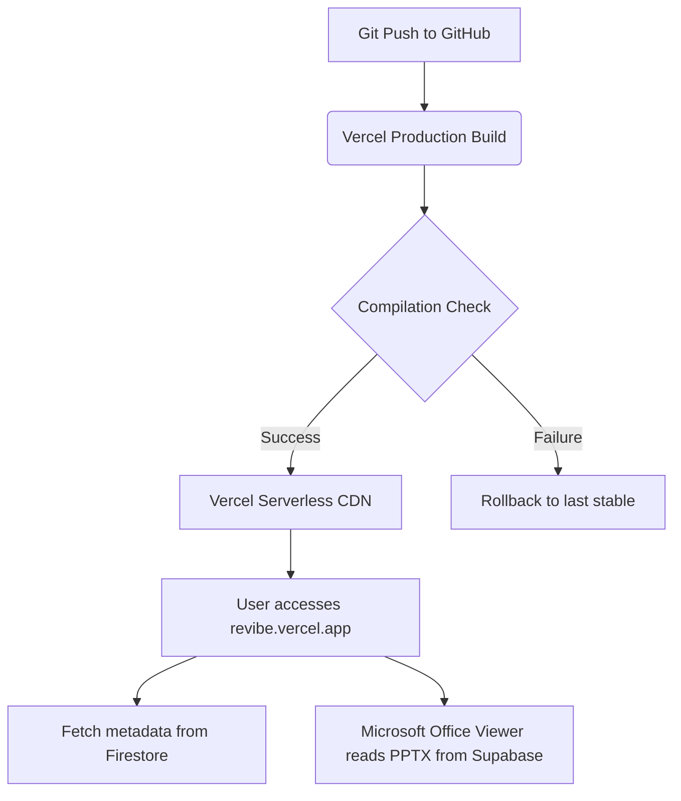

# 🔍 Revibe Training Hub — Codebase Review & Implementation Plan

This document details a full codebase audit and provides an actionable, step-by-step checklist to clean up, secure, optimize, and launch the **Revibe Training Hub** application on Vercel ($0 budget compliant).

---

## 1. Architectural & Codebase Review

### 🚀 Backend & Storage Architecture
- **Supabase Cloud Storage (Primary)**: The client uploads files directly to Supabase storage. This is highly efficient and operates entirely on the client, bypassing Next.js API limits.
- **Firebase Firestore & Auth**: Authenticates users (popup upgraded to redirect to improve mobile compatibility) and hosts document metadata + annotations.
- **Canvas / Drawing Layer**: Fabric.js overlays a drawing canvas over pdfjs-dist. This works perfectly, but annotations are currently bound to individual pages.

### 🧹 Leftover / Obsolete Code
- `app/api/upload/route.js` and `app/api/delete/route.js` are **obsolete**. The client bypasses them to upload directly to Supabase. Having them in the repository exposes unused write endpoints and inflates the codebase.
- `middleware.js` uses a deprecated Next.js naming convention (`middleware`). It should be renamed to `proxy.js` to clear warnings from the build output.

### 🔒 Security Posture
- **API Keys**: All environment variables are prefixed with `NEXT_PUBLIC_` and loaded on the client side. Since they are Firebase client keys and Supabase anon keys, this is secure **provided that backend rules restrict malicious modifications**.
- **Supabase Policies**: Ensure the `materials` bucket has **Public Read** enabled (mandatory for Microsoft Office iframe viewer to fetch `.pptx` slides) but write/delete restricted to authenticated users.

### ⚡ Performance & Aesthetics
- **Fonts & CSS**: Next.js custom local google font setup is correct. Zero layout shift.
- **PDF Web Worker**: We load the worker from `unpkg.com` CDN. This is extremely robust and avoids embedding a heavy 5MB bundle in the client code, improving page speed.
- **LCP Warning**: There is one LCP warning about using `` tags for thumbnails instead of `next/image`. However, since these thumbnails are inline Base64 data-URIs generated on the fly, this warning can be safely ignored (using `next/image` on base64 strings adds unnecessary optimization overhead).

---

## 2. Best Deployment Strategy ($0 Budget)

We recommend deploying to **Vercel** because it has native Next.js 16 App Router compilation, edge routing, and integrates seamlessly with GitHub.

---

## 3. Step-by-Step Action Plan (TO-DO List)

Follow this checklist to clean, secure, and deploy the application.

### Phase 1: Codebase Cleanup
- [x] **Delete Unused Local Upload APIs**
  - [x] Delete file: `app/api/upload/route.js`
  - [x] Delete file: `app/api/delete/route.js`
  - [x] Delete folder: `app/api/upload`
  - [x] Delete folder: `app/api/delete`
- [x] **Fix Deprecated Next.js Conventions**
  - [x] Rename `middleware.js` to `proxy.js`
  - [x] Update export name inside `proxy.js` to `export function proxy(request) { ... }`
- [x] **Sanitize Package Name**
  - [x] Update `"name": "tmp-app"` in `package.json` to `"name": "revibe-training-hub"`

### Phase 2: Security Configurations
- [ ] **Secure Firestore Rules** (in Firebase Console)
  - Allow read/write to `/materials` and `/annotations` for authenticated users only.
- [ ] **Configure Supabase Storage Policies** (in Supabase Dashboard)
  - Set public read on the `materials` bucket to allow Microsoft Office Viewers to stream `.pptx` presentations.
- [ ] **Add Production Domain to Firebase Auth** (in Firebase Console)
  - Go to Auth Settings → Add `revibe-training-hub.vercel.app` (or your custom domain) to the Authorized Domains list.

### Phase 3: Deployment Setup (Vercel)
- [x] **Create Git Repository**
  - [x] Initialize git (`git init`) and commit codebase (ensuring `.env.local` is listed in `.gitignore`).
- [ ] **Connect to Vercel**
  - [x] Push codebase to your remote GitHub repository (`git push -u origin main`).
  - [ ] Import the repository on [vercel.com](https://vercel.com).
  - [ ] Add all 9 client environment variables from `.env.local` inside the Vercel project settings dashboard.
- [ ] **Verify Deploy Build**
  - [ ] Run the build on Vercel dashboard and confirm static routes render successfully.

### Phase 4: Production Verification
- [ ] Login using Google Authentication on the live domain.
- [ ] Upload a test PDF file and verify the dynamic thumbnail is generated.
- [ ] Upload a test PPTX file and verify the Microsoft Office Online Viewer renders all slides correctly without any borders or custom geometry errors.
- [ ] Write a test annotation on a PDF, save it, reload the page, and confirm the annotations are persistent.
